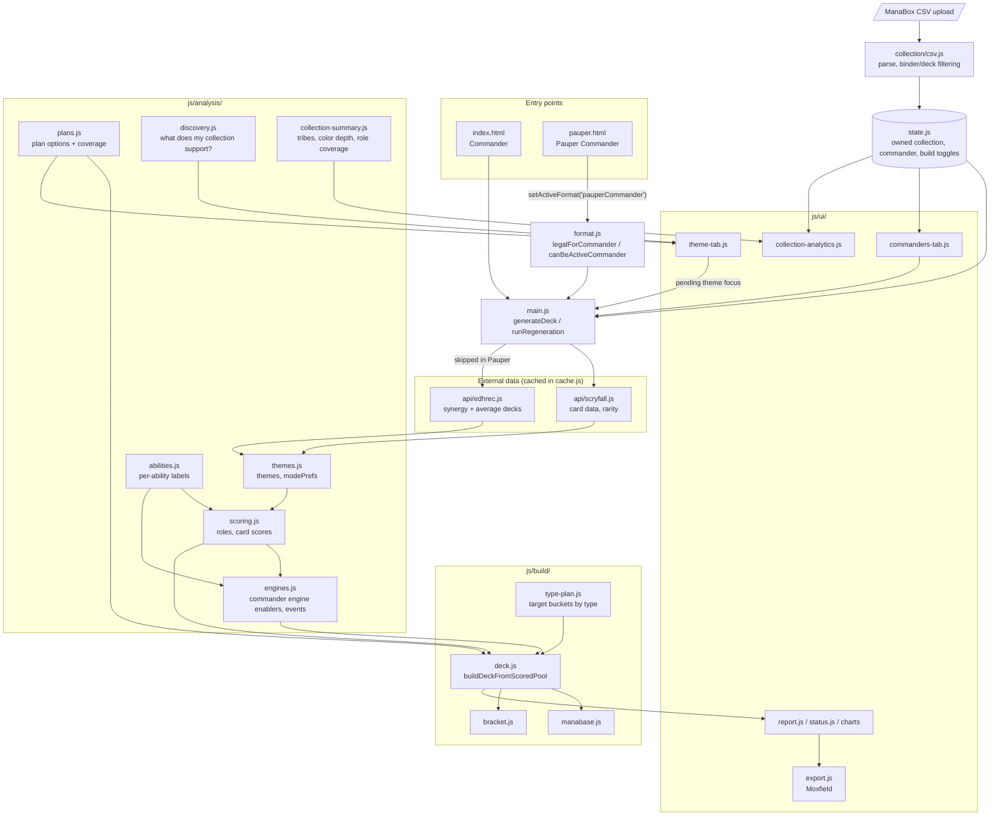
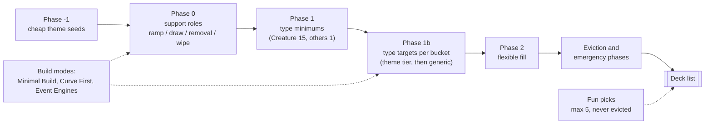

# Bulk to Bracket architecture

Built from the layout and build-pipeline sections of `AGENTS.md`.

## Data flow

```mermaid
flowchart TD
    CSV[/"ManaBox CSV upload"/] --> PARSE["collection/csv.js<br/>parse, binder/deck filtering"]
    PARSE --> STATE[("state.js<br/>owned collection, commander, build toggles")]

    subgraph Pages["Entry points"]
        IDX["index.html<br/>Commander"]
        PDH["pauper.html<br/>Pauper Commander"]
    end
    IDX --> MAIN
    PDH -->|"setActiveFormat('pauperCommander')"| FMT["format.js<br/>legalForCommander / canBeActiveCommander"]
    FMT --> MAIN

    STATE --> MAIN["main.js<br/>generateDeck / runRegeneration"]

    subgraph APIs["External data (cached in cache.js)"]
        SCRY["api/scryfall.js<br/>card data, rarity"]
        EDH["api/edhrec.js<br/>synergy + average decks"]
    end
    MAIN --> SCRY
    MAIN -->|"skipped in Pauper"| EDH

    subgraph Analysis["js/analysis/"]
        THEMES["themes.js<br/>themes, modePrefs"]
        ABIL["abilities.js<br/>per-ability labels"]
        SCORE["scoring.js<br/>roles, card scores"]
        ENG["engines.js<br/>commander engine enablers, events"]
        PLANS["plans.js<br/>plan options + coverage"]
        DISC["discovery.js<br/>what does my collection support?"]
        SUMM["collection-summary.js<br/>tribes, color depth, role coverage"]
    end
    SCRY --> THEMES
    EDH --> THEMES
    ABIL --> SCORE
    ABIL --> ENG
    THEMES --> SCORE
    SCORE --> ENG

    subgraph Build["js/build/"]
        TP["type-plan.js<br/>target buckets by type"]
        DECK["deck.js<br/>buildDeckFromScoredPool"]
        MANA["manabase.js"]
        BR["bracket.js"]
    end
    ENG --> DECK
    SCORE --> DECK
    PLANS --> DECK
    TP --> DECK
    DECK --> MANA
    DECK --> BR

    subgraph UI["js/ui/"]
        CMD["commanders-tab.js"]
        THM["theme-tab.js"]
        ANA["collection-analytics.js"]
        REP["report.js / status.js / charts"]
        EXP["export.js<br/>Moxfield"]
    end
    DECK --> REP
    REP --> EXP
    DISC --> THM
    PLANS --> THM
    SUMM --> ANA
    STATE --> CMD
    STATE --> ANA
    CMD --> MAIN
    THM -->|"pending theme focus"| MAIN
```

## Deck build pipeline (`buildDeckFromScoredPool`)

```mermaid
flowchart LR
    P1["Phase -1<br/>cheap theme seeds"] --> P0["Phase 0<br/>support roles<br/>ramp / draw / removal / wipe"]
    P0 --> PM["Phase 1<br/>type minimums<br/>(Creature 15, others 1)"]
    PM --> PT["Phase 1b<br/>type targets per bucket<br/>(theme tier, then generic)"]
    PT --> PF["Phase 2<br/>flexible fill"]
    PF --> EV["Eviction and<br/>emergency phases"]
    EV --> OUT[["Deck list"]]

    FUN["Fun picks<br/>max 5, never evicted"] -.-> OUT
    MODES["Build modes:<br/>Minimal Build, Curve First, Event Engines"] -.-> P0
    MODES -.-> PT
```
